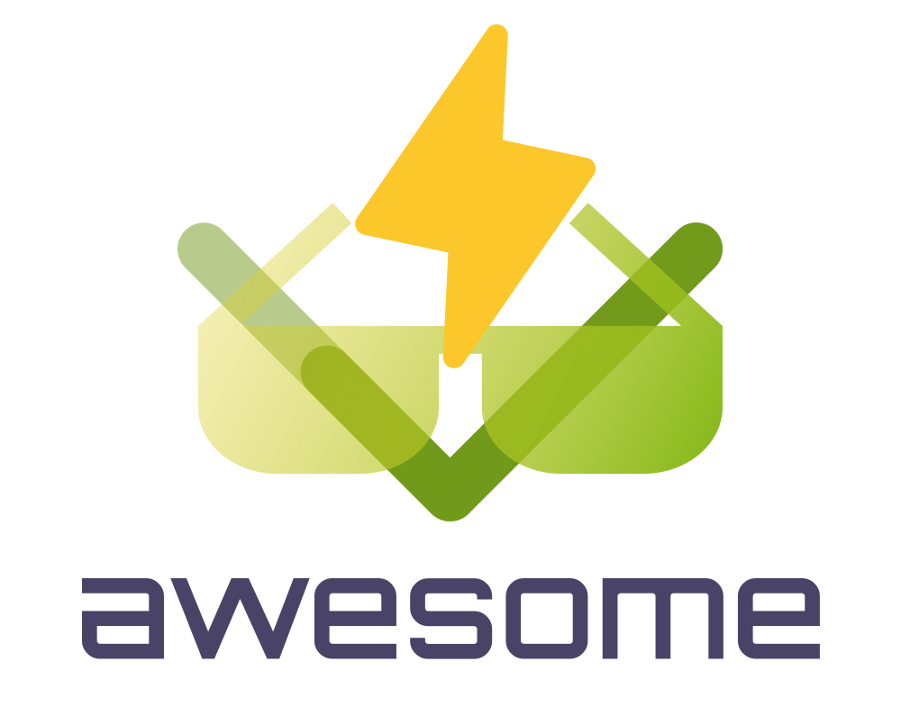

<!--lint disable awesome-heading awesome-github awesome-toc double-link -->

   
  
   
   

<h2 align='center'>Awesome Vitest</h2>

A curated list of awesome things related to <a href='https://github.com/vitest-dev/vitest'>Vitest</a>
  

<!--lint ignore-->

## Table of Contents

Use the "Table of Contents" menu on the top-left corner to explore the list.

## Resources

### Community

- [Twitter](https://twitter.com/vitest_dev)
- [Mastodon](https://elk.zone/m.webtoo.ls/@vitest)
- [Discord](https://chat.vitest.dev/)

### Podcasts

- [Learn with Jason - Fast Unit Testing With Vitest](https://www.learnwithjason.dev/fast-unit-testing-with-vitest)
- [PodRocket - Vitest and VueUse with Anthony Fu](https://twitter.com/PodRocketpod/status/1568267996652601347)
- [Why Vitest Is Better Than Jest](https://www.youtube.com/watch?v=7f-71kYhK00)
- [Learn Vitest and Testing Library In 40 Minutes](https://www.youtube.com/watch?v=FJRuG85tXV0)
- [How to test Vite projects using Vitest](https://www.youtube.com/watch?v=rBdGDiwVyes)
- [Vitest: testing DX reimagined, Vladimir, ViteConf 2022](https://www.youtube.com/watch?v=oB553Noerlc)
- [【Vitest 入门系列】Vitest 的初体验 | 前端新一代的测试框架 | 快快快](https://www.bilibili.com/video/BV1mg41167VX/?vd_source=0233b34ff2aaf46322241da1201a50b9)

### Official Resources

- [Documentation](https://vitest.dev/)
- [GitHub Repo](https://github.com/vitest-dev/vitest)
- [Release Notes](https://github.com/vitest-dev/vitest/releases)
- [Vite Docs](https://vitejs.dev/)
- [Awesome Vite](https://github.com/vitejs/awesome-vite)
- [Migration from Jest](https://vitest.dev/guide/migration.html)

## Get Started

- [examples vue](https://github.com/vitest-dev/vitest/tree/main/examples/vue) - Vitest in Vue.js example
- [examples fastify](https://github.com/vitest-dev/vitest/tree/main/examples/fastify) - Vitest in fastify example
- [examples graphql](https://github.com/vitest-dev/vitest/tree/main/examples/graphql) - Vitest in graphql example
- [examples lit](https://github.com/vitest-dev/vitest/tree/main/examples/lit) - Vitest in lit example
- [examples mocks](https://github.com/vitest-dev/vitest/tree/main/examples/mocks) - Vitest in mocks example
- [examples nextjs](https://github.com/vitest-dev/vitest/tree/main/examples/nextjs) - Vitest in nextjs example
- [examples playwright](https://github.com/vitest-dev/vitest/tree/main/examples/playwright) - Vitest in playwright example
- [examples puppeteer](https://github.com/vitest-dev/vitest/tree/main/examples/puppeteer) - Vitest in puppeteer example
- [examples react](https://github.com/vitest-dev/vitest/tree/main/examples/react) - Vitest in react example
- [examples ruby](https://github.com/vitest-dev/vitest/tree/main/examples/ruby) - Vitest in ruby example
- [examples solid](https://github.com/vitest-dev/vitest/tree/main/examples/solid) - Vitest in solid example
- [examples svelte](https://github.com/vitest-dev/vitest/tree/main/examples/svelte) - Vitest in svelte example
- [examples vue-jsx](https://github.com/vitest-dev/vitest/tree/main/examples/vue-jsx) - Vitest in vue-jsx example

### Templates

- [react-ts-starter](https://github.com/CodingGarden/react-ts-starter) - A bare-bones vite + react + typescript starter template with eslint + prettier, vitest + @testing-library and react-router
- [tauri-vue-template](https://github.com/Uninen/tauri-vue-template) - Tauri + Vue + Vite template w/ Vitest, Tailwind, and GH Actions configured.
- [vitesse](https://github.com/antfu/vitesse) - Opinionated Vite + Vue Starter Template

## Plugins

- [vite-plugin-vitest-typescript-assert](https://github.com/skarab42/vite-plugin-vitest-typescript-assert) - TypeScript type assertion plugin for vitest
- [eslint-plugin-vitest](https://github.com/veritem/eslint-plugin-vitest) - eslint plugin for vitest.
- [vitest-github-actions-reporter](https://github.com/sapphi-red/vitest-github-actions-reporter) - Vitest reporter to create annotations when running tests in GitHub Actions
- [vitest-plugin-github-actions](https://github.com/elonehoo/vitest-plugin-github-actions) - GitHub actions error and coverage reporter for vitest.

## Projects Using Vue.js

### Open Source
- [Vue.js](https://github.com/vuejs/core) - Vue.js is a progressive, incrementally-adoptable JavaScript framework for building UI on the web.
- [Vite.js](https://github.com/vitejs/vite) - Next generation frontend tooling. It's fast!
- [tinyspy](https://github.com/tinylibs/tinyspy) - minimal fork of nanospy, with more features
- [vitest-preview](https://github.com/nvh95/vitest-preview) - Debug your Vitest tests. Effortlessly. 
- [nuxt-vitest](https://github.com/danielroe/nuxt-vitest) - An in-development vitest environment with support for testing code that needs a Nuxt runtime environment
- [slidev](https://github.com/slidevjs/slidev) - Presentation Slides for Developers
- [unocss](https://github.com/unocss/unocss) - The instant on-demand atomic CSS engine.
- [vueuse](https://github.com/vueuse/vueuse) - Collection of essential Vue Composition Utilities for Vue 2 and 3
- [vite-plugin-vue-markdown](https://github.com/mdit-vue/vite-plugin-vue-markdown) - Compile Markdown to Vue component
- [mdit-vue](https://github.com/mdit-vue/mdit-vue) - markdown-it plugins for Vue.js
- [element-plus](https://github.com/element-plus/element-plus) - A Vue.js 3 UI Library made by Element team
- [vitest-mock-extended](https://github.com/eratio08/vitest-mock-extended) - Type safe mocking extensions for Vitest.
